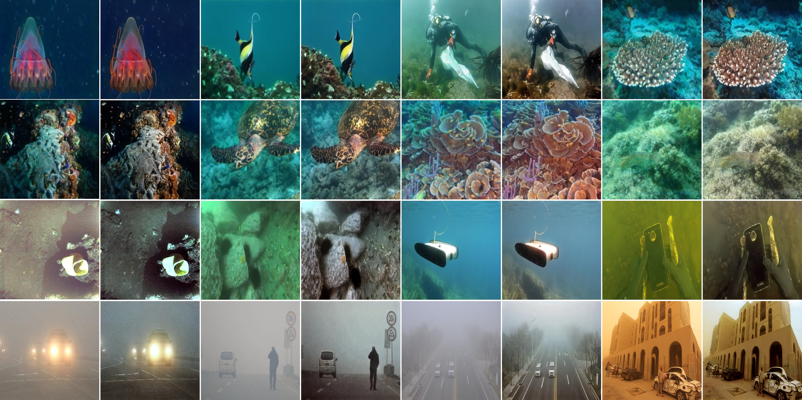

# OUIEDM: Underwater Image Enhancement with One-step Diffusion Model

## Datasets
Real Underwater Data including LSUI and UIEBD for [google drive] and [Baidu Drive] are released.

We use a underwater camera captured real-world underwater image datasets in Shenzhen, Guangdong province, China. The dataset includes 300 images for [google drive] and [Baidu Drive] are released. If you want to use the LSUI dataset, please cite our [paper].

  
## Underwater Enhancement and dehazing

 

